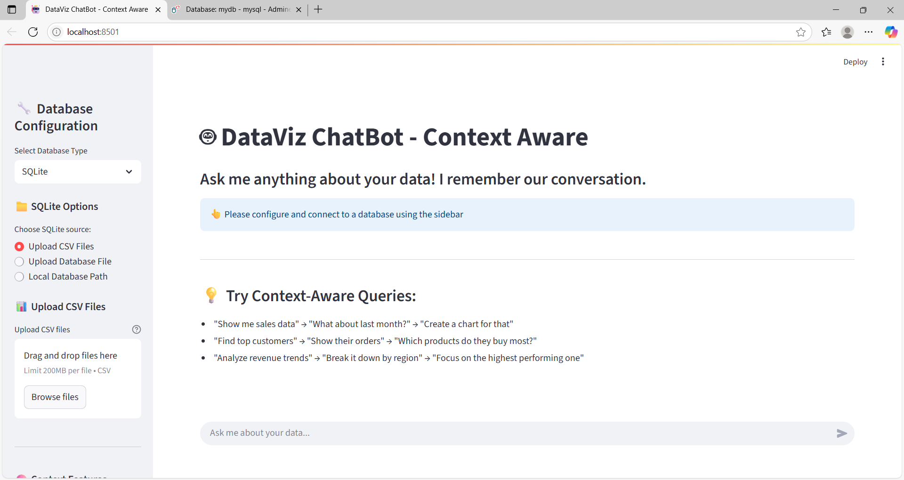
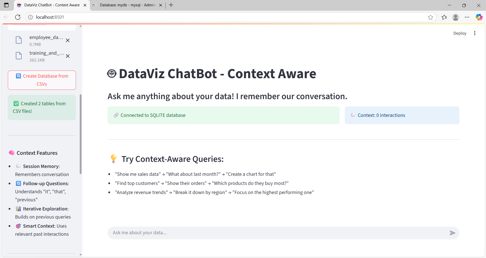
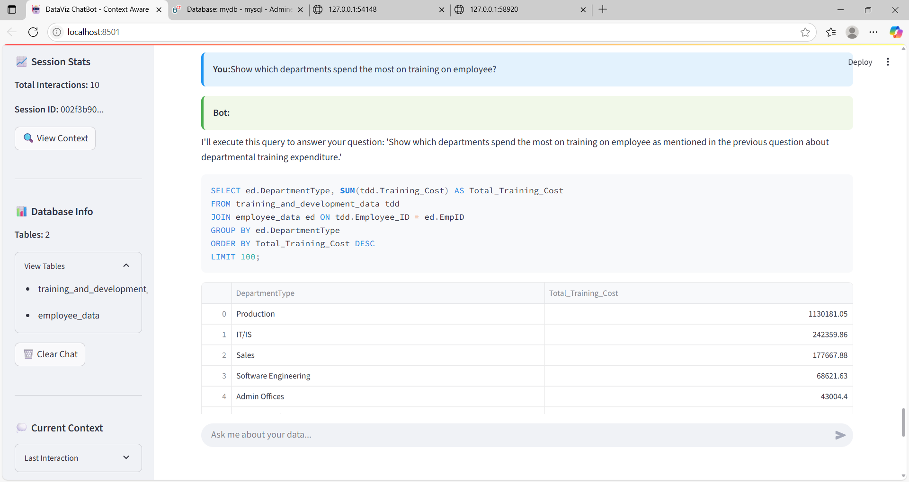
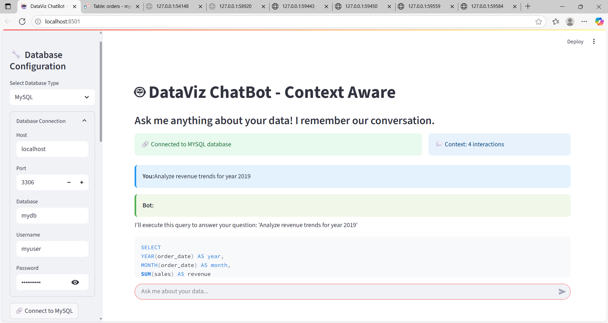
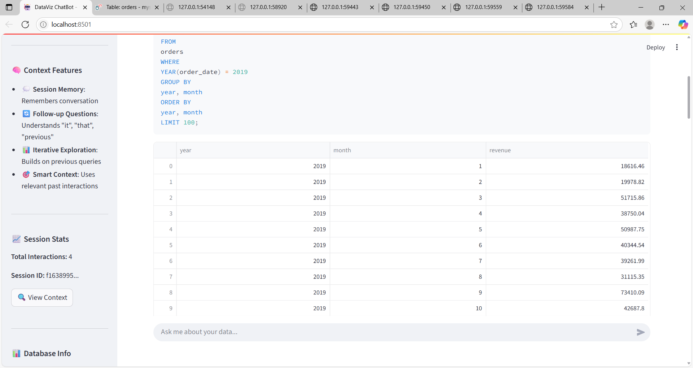
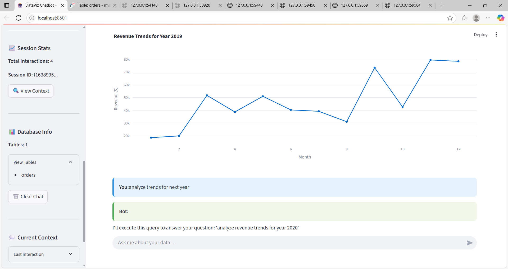
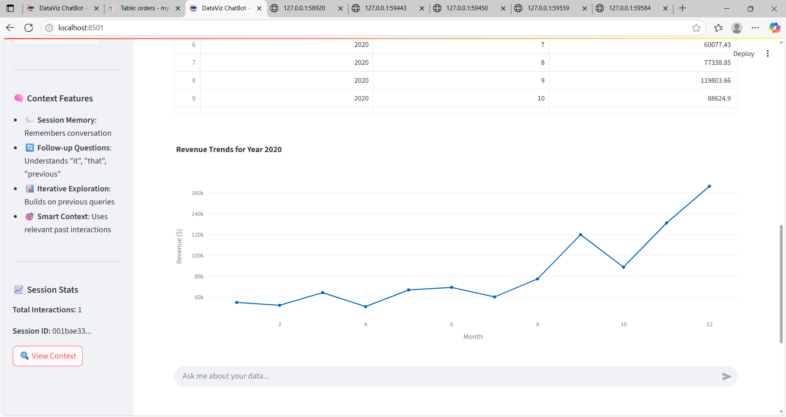

# Prompt-Driven Data Visualizer

A powerful chatbot application that converts natural language queries into SQL queries and generates interactive data visualizations. This project enables users to interact with their databases using plain English, making data analysis accessible to non-technical users.

## 🚀 Features

- **Natural Language to SQL**: Convert plain English questions into optimized SQL queries
- **Multi-Database Support**: Works with PostgreSQL, MySQL, and SQLite databases
- **Automatic Chart Generation**: Creates interactive visualizations using Plotly
- **CSV File Upload**: Import CSV files and create SQLite tables automatically
- **Database File Upload**: Upload existing SQLite database files
- **Schema Exploration**: Browse database structure and table information
- **Interactive Chat Interface**: Streamlit-based conversational UI
- **Error Handling**: Comprehensive error management and user-friendly messages
- **Query Validation**: Security measures to prevent dangerous SQL operations

## 🏗️ Architecture

The application follows a modular architecture with the following components:

### Core Modules

- **Query Processor** (`nlp/query_processor.py`): Handles natural language processing and SQL generation
- **Database Connectors** (`utils/`): Abstracted database connection layer supporting multiple database types
- **Chart Generator** (`visualization/chart_generator.py`): Creates interactive visualizations from query results
- **Error Handler** (`utils/error_handler.py`): Centralized error management
- **Logger** (`utils/logger.py`): Application logging utilities

### Database Connectors

- **PostgreSQL Connector** (`utils/postgres_connector.py`)
- **MySQL Connector** (`utils/mysql_connector.py`)
- **SQLite Connector** (`utils/sqlite_connector.py`)

## 📋 Requirements

### Dependencies

```
streamlit
pandas
plotly
langchain
langchain-groq
sqlalchemy
psycopg2-binary
pymysql
python-dotenv
pillow
```

### Environment Variables

Create a `.env` file in the project root:

```env
GROQ_API_KEY=your_groq_api_key_here
```

## 🛠️ Installation

1. **Clone the repository**
```bash
git clone https://github.com/Soumya0927/Prompt-Driven-Data-visualizer.git
cd prompt-driven-data-visualizer
```

2. **Install dependencies**
```bash
pip install -r requirements.txt
```

3. **Set up environment variables**
```bash
touch .env
# Edit .env with your API keys
```

4. **Run the application**
```bash
streamlit run app.py
```

## 🐳 Docker Setup

The project includes Docker Compose configuration for running PostgreSQL and MySQL databases:

```bash
docker-compose up -d
```

This will start:
- PostgreSQL on port 5432
- MySQL on port 3306
- Adminer (database management) on port 8080

## 💻 Usage

### Database Connection

1. **SQLite Options**:
   - Upload CSV files to create tables automatically
   - Upload existing SQLite database files
   - Connect to local SQLite database files

2. **PostgreSQL/MySQL**:
   - Enter connection details in the sidebar
   - Test connection before proceeding

### Sample Queries

- "Show me all tables in the database"
- "What are the top 10 products by revenue?"
- "Create a chart showing sales trends over time"
- "Find the distribution of customer ages"
- "Show me the schema for the users table"

### Chart Generation

The system automatically generates appropriate visualizations based on:
- Data types (numeric, categorical, datetime)
- Query context and user intent
- Best practices for different chart types

## 🔧 Configuration

### Database Templates

The query processor uses database-specific SQL templates:

- **PostgreSQL**: Uses `ILIKE` for case-insensitive searches, proper date handling
- **MySQL**: Uses `LIKE` for text searches, MySQL-specific syntax
- **SQLite**: Optimized for SQLite limitations and features

### Chart Types

Supported visualization types:
- Line charts for time series data
- Bar charts for categorical comparisons
- Scatter plots for relationships
- Histograms for distributions
- Pie charts for proportions
- Tables for detailed data display

## 🛡️ Security Features

- **Query Validation**: Prevents dangerous SQL operations (DROP, DELETE, UPDATE, etc.)
- **Input Sanitization**: Protects against SQL injection attacks
- **Read-Only Operations**: Only SELECT queries are allowed
- **Connection Timeouts**: Prevents hanging connections

## 📁 Project Structure

```
prompt-driven-data-visualizer/
├── app.py                          # Main Streamlit application
├── docker-compose.yml              # Docker services configuration
├── Dockerfile                      # Docker container setup
├── requirements.txt                # Python dependencies
├── .env.example                    # Environment variables template
├── nlp/
│   └── query_processor.py          # Natural language processing
├── utils/
│   ├── base_connector.py           # Abstract database connector
│   ├── postgres_connector.py       # PostgreSQL connector
│   ├── mysql_connector.py          # MySQL connector
│   ├── sqlite_connector.py         # SQLite connector
│   ├── error_handler.py            # Error management
│   └── logger.py                   # Logging utilities
├── visualization/
│   └── chart_generator.py          # Chart generation logic
└── logs/                           # Application logs
```

## 🤝 Contributing

1. Fork the repository
2. Create a feature branch (`git checkout -b feature/amazing-feature`)
3. Commit your changes (`git commit -m 'Add amazing feature'`)
4. Push to the branch (`git push origin feature/amazing-feature`)
5. Open a Pull Request

## 📝 License

This project is licensed under the MIT License - see the LICENSE file for details.

## 🔮 Future Enhancements

- Support for additional database types (Oracle, SQL Server)
- Advanced analytics and statistical functions
- Export functionality for charts and data
- User authentication and session management
- Query history and favorites
- Advanced chart customization options
- Real-time data streaming support

## 🐛 Troubleshooting

### Common Issues

1. **Connection Errors**: Verify database credentials and network connectivity
2. **API Key Issues**: Ensure GROQ_API_KEY is properly set in .env file
3. **Chart Generation Failures**: Check data types and query results
4. **CSV Upload Problems**: Verify file format and column names

### Logging

Application logs are stored in the `logs/` directory with daily rotation. Check these files for detailed error information.

## 📞 Support

For issues and questions:
- Check the troubleshooting section
- Review application logs
- Open an issue on the project repository

**Built with ❤️ using Streamlit, LangChain, and Plotly**


# Prompt-Driven Data Visualizer

A context-aware chatbot that converts natural language queries into SQL and generates interactive visualizations from database results.

## 🚀 Overview

The Prompt-Driven Data Visualizer is an intelligent assistant that bridges the gap between natural language and database analytics. It allows users to interact with their databases using conversational queries and automatically generates meaningful visualizations from the results.

### Key Features

- **Natural Language Processing**: Convert plain English questions into SQL queries
- **Context Awareness**: Maintains conversation history for follow-up questions
- **Multi-Database Support**: Works with PostgreSQL, MySQL, and SQLite
- **Interactive Visualizations**: Auto-generates charts using Plotly
- **CSV Import**: Upload CSV files to create instant SQLite databases
- **Session Management**: Persistent conversation memory
- **Smart Reference Resolution**: Understands pronouns and context references

## 🏗️ Architecture

The system is built with a modular architecture consisting of:

- **Core NLP Engine**: Context-aware query processing with LLM integration
- **Database Connectors**: Multi-database support with optimized queries
- **Visualization Engine**: Intelligent chart generation based on data types
- **Session Management**: Persistent conversation tracking
- **Frontend Interface**: Streamlit-based chat interface

## 🛠️ Installation

### Prerequisites

- Python 3.8+
- Docker (for database containers)
- API keys for Groq and OpenAI

### Setup Steps

1. **Clone the repository:**
```bash
git clone https://github.com/Soumya0927/Prompt-Driven-Data-visualizer.git
cd prompt-driven-data-visualizer
```

2. **Install dependencies:**
```bash
pip install -r requirements.txt
```

3. **Configure environment variables:**
```bash
touch .env
# Edit .env with your API keys
```

4. **Start database containers (optional):**
```bash
docker-compose up -d
```

5. **Run the application:**
```bash
streamlit run app.py
```

## 🔧 Configuration

### Environment Variables

Create a `.env` file with the following variables:

```env
GROQ_API_KEY=your_groq_api_key_here
OPENAI_API_KEY=your_openai_api_key_here
```

### Database Setup

The application supports three database types:

#### SQLite
- **Upload CSV files**: Automatically creates tables from CSV data
- **Upload database file**: Connect to existing SQLite databases
- **Local file path**: Connect to local SQLite files

#### PostgreSQL
- Host, port, database name, username, and password required
- Default connection: `localhost:5432`

#### MySQL
- Host, port, database name, username, and password required
- Default connection: `localhost:3306`

## 📊 Usage

### Basic Queries

```
"Show me all customers"
"What's the total revenue by month?"
"Find the top 10 products by sales"
```

### Context-Aware Queries

```
User: "Show me sales data"
Bot: [Returns sales data with chart]

User: "What about last month?"
Bot: [Filters previous query for last month]

User: "Create a bar chart for that"
Bot: [Generates bar chart from last month's data]
```

### Supported Query Types

- **Data Queries**: Retrieve and visualize data
- **Schema Queries**: Explore database structure
- **General Queries**: Get help and explanations
- **Follow-up Questions**: Build on previous interactions

## 🎨 Visualization Types

The system automatically generates appropriate visualizations based on:
- Data types (numeric, categorical, datetime)
- Query context and user intent
- Best practices for different chart types

## 🧠 Context Management

### Session Features

- **Memory Persistence**: Conversations saved across sessions
- **Reference Resolution**: Understands "it", "that", "previous",etc.
- **Follow-up Detection**: Recognizes continuation queries
- **Context Filtering**: Only uses relevant previous interactions

### Session Controls

- View conversation history
- Clear chat and reset context
- Monitor session statistics
- Export conversation logs

## 📁 Project Structure

```
prompt-driven-data-visualizer/
├── app.py                          # Main Streamlit application
├── .env                            # Environment variables 
├── nlp/                           # Natural language processing
│   ├── context_aware_processor.py # Main query coordinator
│   ├── context_manager.py        # Conversation context handling
│   ├── database_templates.py     # Database-specific SQL templates
│   ├── query_classifier.py       # Query type classification
│   ├── reference_resolver.py     # Pronoun and reference resolution
│   ├── session_manager.py        # Session persistence
│   └── sql_generator.py          # SQL query generation
├── utils/                         # Database connectors and utilities
│   ├── base_connector.py         # Abstract database connector
│   ├── mysql_connector.py        # MySQL database connector
│   ├── postgres_connector.py     # PostgreSQL database connector
│   ├── sqlite_connector.py       # SQLite database connector
│   ├── error_handler.py          # Error handling utilities
│   └── logger.py                 # Logging utilities
├── visualization/                 # Chart generation
│   └── chart_generator.py        # Plotly chart generation
├── sessions/                      # Session storage (auto-created)
├── logs/                         # Application logs (auto-created)
├── docker-compose.yml            # Database containers
├── Dockerfile                    # Container configuration
└── requirements.txt              # Python dependencies
```

## 🔍 Key Components

### ContextAwareQueryProcessor
Main coordinator that orchestrates query processing with intelligent context awareness.

### SessionManager
Handles conversation persistence, context retrieval, and follow-up pattern detection.

### ChartGenerator
Generates Python code for visualizations using Plotly based on natural language descriptions.

### Database Connectors
Optimized connectors for different database types with security validation and error handling.

## 🚦 Error Handling

The system includes comprehensive error handling for:

- Database connection failures
- SQL syntax errors
- Authentication issues
- Network timeouts
- API service errors
- Data processing errors
- Visualization failures

##  Live Demo

## 🎯SQLite
### 1. Initial Setup - Database Configuration

The application starts with a clean interface where you can configure your database connection:



Choose SQLite and upload your CSV files to create an instant database.

### 2. File Upload and Database Creation

Upload multiple CSV files to automatically create related tables:



The system successfully creates tables from your uploaded files:
- `employee_data` table (0.7MB)
- `training_and_development_data` table (262.1KB)

### 3. Natural Language Query Processing

Ask questions in plain English and watch the system generate SQL queries:




### 4. Automatic Visualization Generation

The system automatically creates appropriate charts based on your data:


The bar chart clearly shows that **Production** department has the highest training costs, followed by IT/IS, Sales, Software Engineering, Admin Offices, and Executive Office.

## 🎯 MySQL (similar working with PostgreSQL)

### 1. Database Configuration & Connection

Start by configuring your database connection with the intuitive interface:




### 2. Ask question to database

Execute complex analytical queries using natural language:




**Results:** Monthly revenue data from January to October 2019, showing fluctuations from $18,616 to $51,716.

### 3. Automatic Chart Generation

The system automatically creates professional visualizations:



**Key insights from the chart:**
- **Seasonal patterns** - Revenue peaked in March ($51,716) and May ($50,988)
- **Growth trajectory** - Strong recovery in later months
- **Trend analysis** - Clear visualization of monthly performance variations

### 4. Follow-up Questions

Demonstrate **context-aware capabilities** with follow-up queries:


**Follow-up Query:** "analyze trends for next year"

The system intelligently:
- **Remembers context** - Knows "next year" means 2020
- **Adapts SQL** - Automatically updates the WHERE clause to `YEAR(order_date) = 2020`
- **Maintains structure** - Uses the same analytical framework



**2020 Results:** Shows revenue data from January to July 2020, ranging from $50,807 to $69,243.


## 🧪 Testing

### Manual Testing

1. Connect to a database
2. Try basic queries: "Show me all tables"
3. Test context features: Ask follow-up questions
4. Upload CSV files (SQLite mode)
5. Generate various chart types

### Database Testing

Use the provided Docker containers for testing:

```bash
# Start test databases
docker-compose up -d

# Access Adminer (database management)
# Navigate to http://localhost:8080
```

## 🔒 Security Features

- **Query Validation**: Prevents dangerous SQL operations
- **Connection Security**: Uses parameterized queries
- **API Key Management**: Secure environment variable handling
- **File Upload Safety**: Validates and sanitizes uploaded files

## 📈 Performance Optimizations

- **Connection Pooling**: Efficient database connection management
- **Query Caching**: Reduces redundant database calls
- **Context Filtering**: Only processes relevant conversation history
- **Lazy Loading**: Components initialized on demand

## 🤝 Contributing

1. Fork the repository
2. Create a feature branch
3. Make your changes
4. Add tests if applicable
5. Submit a pull request

## 📝 License

This project is licensed under the MIT License - see the LICENSE file for details.

## 🎯 Future Enhancements

- **Advanced Analytics**: Statistical analysis and ML insights
- **Multi-user Support**: Team collaboration features
- **Export Capabilities**: PDF and Excel report generation
- **Advanced Visualizations**: 3D charts and interactive dashboards
- **Voice Interface**: Speech-to-text query input
- **Scheduled Reports**: Automated report generation

## 📞 Support

For issues and questions:
- Create an issue on the repository
- Check the logs in the `logs/` directory
- Review session data in the `sessions/` directory

**Built with ❤️ using Streamlit, LangChain, and Plotly**
